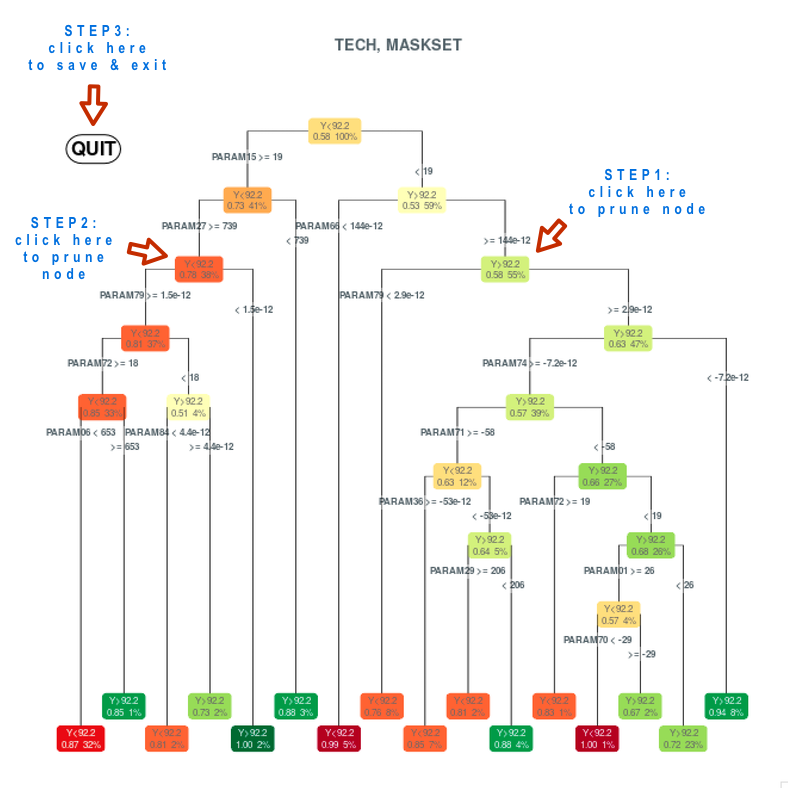
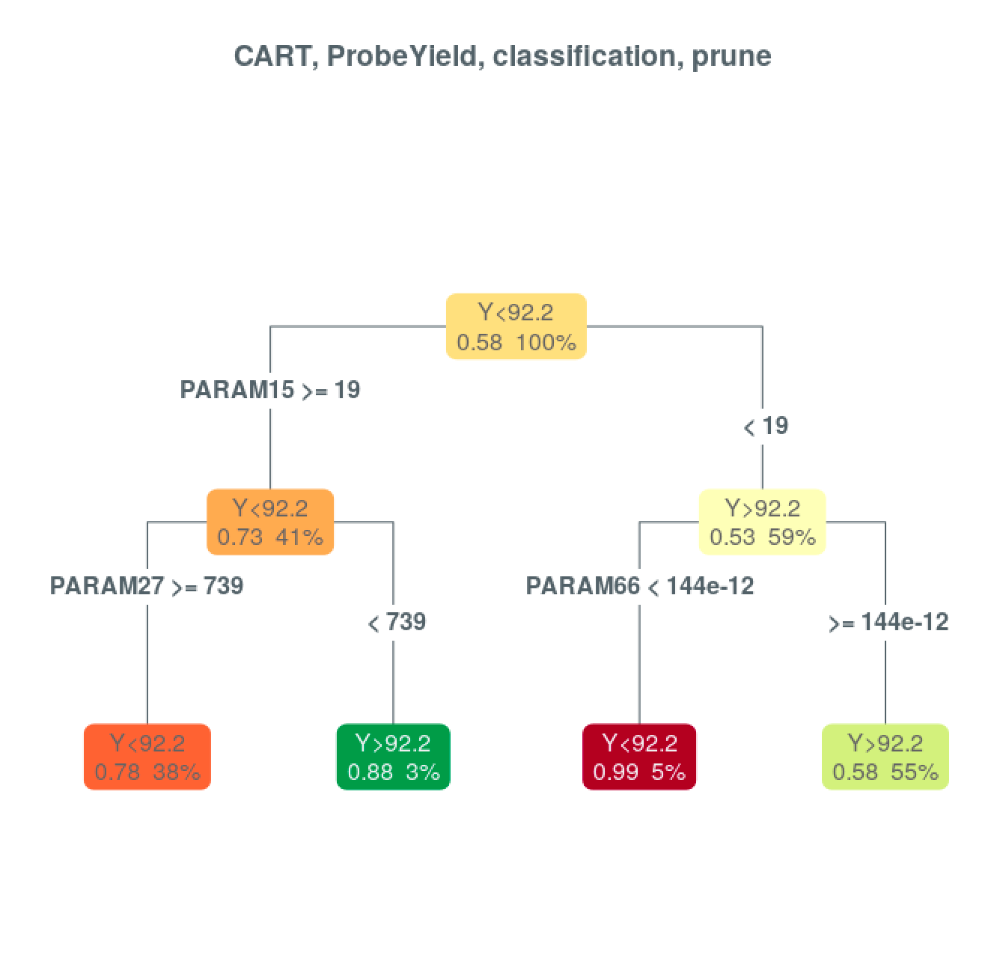

```{r, include = FALSE}
knitr::opts_chunk$set(
  collapse = TRUE,
  comment = "#>",
  fig.align="center",
  fig.width=6, 
  fig.height=6,
  out.width="50%",
  dpi=200,
  tidy=FALSE
)
options(width=80)
```

_version: 2020/03_ 


***

**_note_**: *This document looks into Classification and Regression Trees, as a part of the inLabZero package developed by Inference Technologies. For more information on the inLabZero package, please refer to: [inLabZero introduction vignette](InLabIntro.html)*  

***


## Classification and Regression Trees   

**Classification and regression trees (CART)** refer to decision tree algorithms that can be used for classification or regression predictive modeling problems. A tree is built by splitting the source dataset into subsets so that each subset is as pure or homogenous as possible. Algorithms for constructing decision trees usually work top-down, by choosing a variable at each step that best splits the set of items. Several metrics like *Gini impurity* for classification or *sum square errors* for regression are used during tree construction. 

Regression and classification are both categorized as supervised machine learning algorithms that utilize training datasets to make predictions. The main difference between them is that the output variable in regression is *numerical* (or continuous) while it is *categorical* (or discrete) for classification. 

CART advantage is that it is simple to build, understand, interpret and visualize. The model is also able to handle both numerical and categorical data.

On the other hand, the decision trees are prone to being **biased**, where some classes dominate. It is therefore recommended to *balance* the dataset prior to its fitting with the decision tree. Small variations in the data might result in a completely different tree. This is called **variance**, which can be lowered by methods of bagging or boosting (for more information on bagging please refer to [Random Forest vignette](RandomForest.html) and for boosting to [X Gradient Boosting vignette](XGBoost.html)). 

Creation of trees that do not generalize the data well may lead to poor accuracy on unseen data because of **overfitting**. Another way to overfit the model is to build over-complex, fully grown trees. To tackle the model complexity we can *prune* back the tree by selecting the complexity parameter (cp) associated with acceptable cross-validation error. In general, simple trees are preferred (lower number of splits), as they are much easier to interpret and work with, as well as the probability of overfitting the data is lower. 

In this vignette, we will demonstrate three **applications of CART**:

1. [Classification tree with response parameter `ProbeYield`](#CT_ProbeYield)
2. [Classification tree with response parameter `cluster`](#CT_Cluster)
3. [Regression tree with response parameter `ProbeYield`](#RT_ProbeYield)


<br>

### 1. Classification tree: response parameter `ProbeYield` {#CT_ProbeYield} 


As mentioned earlier, classification problems  where the output variable is categorical can be addressed via classification trees. 

The *inLabZero package* features the function `model` as the models wrapper to perform regression and classification (*note*: it can also be used for clustering and dimensionality reduction). Let us call the function on the process control dataset, `pcy`, and store the model outcome to metadata of the `pcy` dataset. We can specify the type of the model via the `type` parameter. It can either equal to `class` (for classification models) or `reg` (for regression models). The particular model is defined via the `model` function parameter, where `cart` applies to Classification and Regression Tree. The `formula` parameter represents standard formula input, which characterizes the response parameter and the input parameters, in our case we choose the response parameter `ProbeYield`, which is also set as default.       

```{r}
library(inLabZero)
```

```{r echo=FALSE}
data(pcy)
```

```{r echo=FALSE}
modelPlotPar(default)
```

The following call will train the CART classification of `ProbeYield` on all parameters. The parameter `seed` is useful for creating simulations or random objects that can be reproduced, so we will use the same setting throughout the vignette. 

```{r results="hide"}
# Train CART classification of 'ProbeYield' (median response split by default) 
# on all parameters
pcy <- model(pcy, type="class", model="cart", formula="ProbeYield ~ .", seed=42) 
```

Model visualizations can be done with the use of the `modelPlot` function applied on the `pcy` variable where we have previously stored the model results. The node labels can also be customized. Parameter `extra` specifies level of details to the node labels (for more details please refer to the `rpart.plot` package). The length of variable names in text at the CART splits can be defined via `varlen`. Use `varlen=0` to display full variable name. The ProbeYield CART model can be seen below.  

For all trees present in this vignette, the following rules apply:

- `Yes` to the left - condition at the split point holds
- `No` to the right - condition at the split point is rejected

**Each node shows:**

- the split condition (e.g. `ProbeYield` value split)
- the percentage of values out of all values in the dataset (bottom right part of the node)
- the probability of each class in the constrained area (bottom left part of the node)  

```{r}

```


```{r out.width="100%"}
modelPlot(pcy, varlen=0, main="CART, ProbeYield, classification", extra=108)
```

<br>

#### Interactive tree pruning 

When dealing with classification and regression problems, the goal is to find few strong sensitivity driven splits, not a complex predictive model. The usual approach consists in growing a large tree and pruning (simplifying) it back. This simplifies the work and interpretation to a great deal.

The `modelPlot` function allows to interactively trim the tree. If we run the `modelPlot` function with the `snip` parameter set to `TRUE`, the tree is displayed and we can interactively trim it with the mouse. If the user clicks on a split, it will be marked as deleted. If the user clicks on a split that was already deleted (under the condition that its parent is not deleted), it will be undeleted. Once trimming is finished, the `QUIT` button needs to be clicked. 


```{r, eval=FALSE, results="hide"}
pcy <- modelPlot(pcy, snip=T)
```

<center>
  
</center>

Now, if we have pruned the tree in the previous step (deleted some nodes) and saved the result in `pcy`, it is possible to look at the trimmed tree calling the `mapPlot` function on the `pcy` variable.

```{r eval=FALSE}
modelPlot(pcy, varlen=0, main="CART, ProbeYield, classification, prune", extra=108) 
```

<center>
    
</center>

#### Tree pruning with complexity parameter (cp)


The size of the decision tree can also be controlled via the complexity parameter (`cp`), which is associated with the cross-validation error. We select the `cp` value for pruning the tree which has acceptable cross validation error. If the cost of adding another variable to the decision tree from the current node is above the value of `cp`, then tree building does not continue. One could also say that tree construction does not continue unless it would decrease the overall lack of fit by a factor of `cp`.

 
```{r results="hide"}
pcy <- model(pcy, type="class", model="cart", formula="ProbeYield ~ .", cp=0.04, 
                                                                          seed=42) 
```

Pruned classification tree using the complexity parameter can be seen below: 

```{r}
modelPlot(pcy, varlen=0, main="CART, ProbeYield, classification, prune", extra=108) 
```

<br>

### 2. Classification tree: response parameter `cluster` {#CT_Cluster}


Let us concentrate on a classification problem,  where the response parameter is a particular cluster. We are selecting the `cp` parameter equal to 0.04. We will now define the cluster name in the `formula` parameter, which was in our previous cases `ProbeYield`.  


```{r results="hide"}
pcyc <- model(pcy, type="class", model="cart", formula="center ~ .", cp=0.04, seed=42) 
```

We can plot the classification tree pruned using the complexity parameter with cluster as response parameter using the following call:

```{r}
modelPlot(pcyc, varlen=0, main="CART, cluster, classification, prune", extra=108)
```
 
 <br>

#### Data balancing


So far, we have been working with cluster `center` only, hence with values 1 and 0, representing either the presence or absence of cluster, respectively. The disadvantage of such a set is that it is highly disbalanced, which is caused by the fact that there are not enough patterns belonging to the positive cases, in our case cluster `center`, comparing to number of wafers w/o cluster `center`.  This can be regarded as a problem in learning from highly imbalanced datasets. 

The `model` function has two parameters to address this problem. Parameter `balance` is used in binary classifications to balance positive and negative cases in the train set. The `balance` parameter defines the multiple of the number of positive cases to be sampled out of negative cases. By default these negative cases are sampled from all wafers except for cluster `center`. From this default negative cases group, a specific cluster could be selected, usually named as `clear`, that comprises all wafers w/o any cluster.  Parameter `balanceCol`  can be used to employ a custom group of wafers for negative case sampling, e.g. cluster `clear`. 

In our example, we use the value of 2 to balance the train set and select cluster `clear` for negative case sampling. We will show the model statistics, so that we can compare the output in the next section.

```{r}
pcyb <- model(pcyc, type="class", model="cart", formula="center ~ .", cp=0.04, 
                                         balance=2, balanceCol="clear", seed=42) 
```

To view the CART model on balanced data: 

```{r}
modelPlot(pcyb, varlen=0, main="CART, cluster, classification, prune, balanced", 
                                                                        extra=108) 
```

In our analysis, we are working with wafers with `center` cluster and we are randomly sampling twice the amount of the wafers from the cluster `clear` for balancing. If we are going to repeat the balancing process, random sampling will vary. In order to always work with the same wafers, we will store the result in the `usedRow` variable using the `modelTrainRow` function. This function gets data rows employed in the model training using the `model` function. Variable `usedRow` will now contain all the wafers with the `center` cluster and the sampled samples from cluster `clear`. 

```{r results="hide"}
usedRow <- modelTrainRow(pcyb) 
```

<br>

#### Train/test split 

To verify the model overfit, model performance is evaluated on data that was not used for model training - *test data*. This is managed by the parameter `splitRatio`, that represents the split ratio of the entire dataset between train and test set. A `splitRatio` of 0.7 denotes that 70 percent of the data will be used for training and 30 percent for testing. By default, this parameter is set to 1. Once the model is trained on the train set, the test set is used to provide an unbiased evaluation of the model fit on the dataset. 


```{r}
pcys <- model(pcyc, type="class", model="cart", formula="center ~ .", cp=0.05, 
                                                        splitRatio=0.7, seed=42) 
```

The plot of the pruned classification tree with train/test split will look the following way:

```{r}
modelPlot(pcys, varlen=0, main="CART, cluster, classification, prune, split", 
                                                                     extra=108)
```

A detailed model summary can be viewed by calling the `summary` function on the model output. Looking at the model statics, we can see the accuracy of the train as well as the test set (without this split into train and test set, the statistics for test data is denoted as `NA`, as can be seen in the previous section). The difference between the AUC of the train and test set is important from the perspective of model evaluation.  

```{r}
summary(pcys) 
```

<br>

### 3. Regression tree: response parameter `ProbeYield` {#RT_ProbeYield}

We have been so far looking at classification trees, let us look at a regression problem, where the output variable is numerical (or continuous). In order to run regression model, we need to define the parameter `type` of the `model` function to `reg`. Other parameters will stay the same as demonstrated before for classification problems. The number in the node denotes the split condition (e.g. ProbeYield value split).

```{r results="hide"}
pcyr <- model(pcy, type="reg", model="cart", formula="ProbeYield ~ .", 
                                                       cp=0.05, seed=42) 
```

Plotting the regression model, we will obtain:

```{r}
modelPlot(pcyr, varlen=0, main="CART, ProbeYield, regression", extra=108) 
```

<br>

#### Train/test split

Similarly to previous examples, we can define the `splitRatio` between the train and test set. 70 percent of the data will be used for training, while 30 percent will be used for testing. The train/test set split has helped to compare the model performance on train and test data to see a potential model overfit.

```{r results="hide"}
pcyrs <- model(pcyc, type="reg", model="cart", formula="ProbeYield ~ .", cp=0.05, 
                                                           splitRatio=0.7, seed=42) 
```

Plotting the regression model:

```{r}
modelPlot(pcyrs, varlen=0, main="CART, ProbeYield, regression, split", extra=108) 
```

Analogously as above, we can apply the `summary` function on the model output to get model specific summary. 

```{r}
summary(pcyrs)
```


